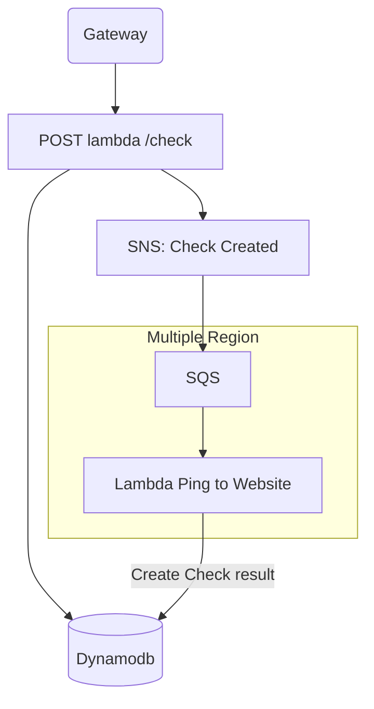
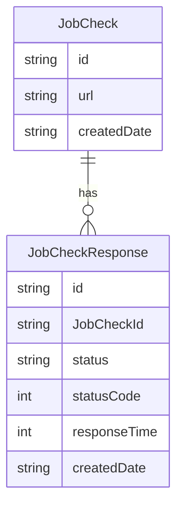

```mermaid
graph TD;
    A(Gateway) --> B[POST lambda /check];
    B --> Database[(Dynamodb)]
    B --> C[SNS: Check Created];
    C --> D[SQS];
    D --> E[Lambda Ping to Website];

    subgraph Multiple Region
      D[SQS];
      E[Lambda Ping to Website];
    end

    E -- Create Check result --> Database

```

```mermaid
erDiagram
    JobCheck {
        string id
        string url
        string createdDate
    }

    JobCheckResponse {
        string id
        string JobCheckId
        string status
        int    statusCode
        int    responseTime
        string createdDate
    }
    
    JobCheck ||--o{ JobCheckResponse : has
```