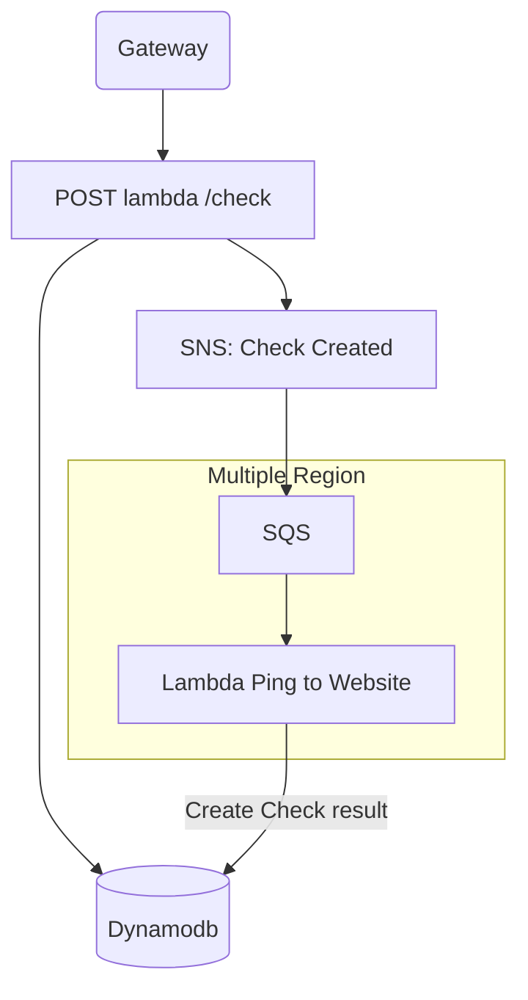
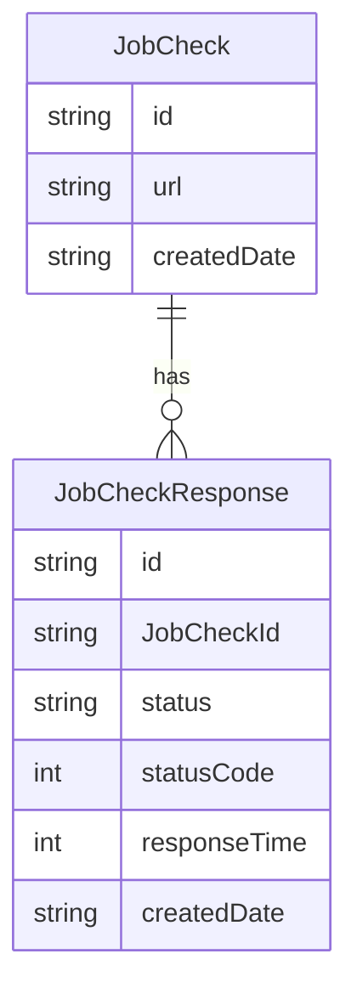

## Invoke function with SAM

```shell
# Invoke single function
sam local invoke --hook-name terraform --event ./src/events/testEvent.json aws_lambda_function.lambda_create_check --env-vars env.jso

# Start API Gateway
sam local start-api --hook-name terraform
```