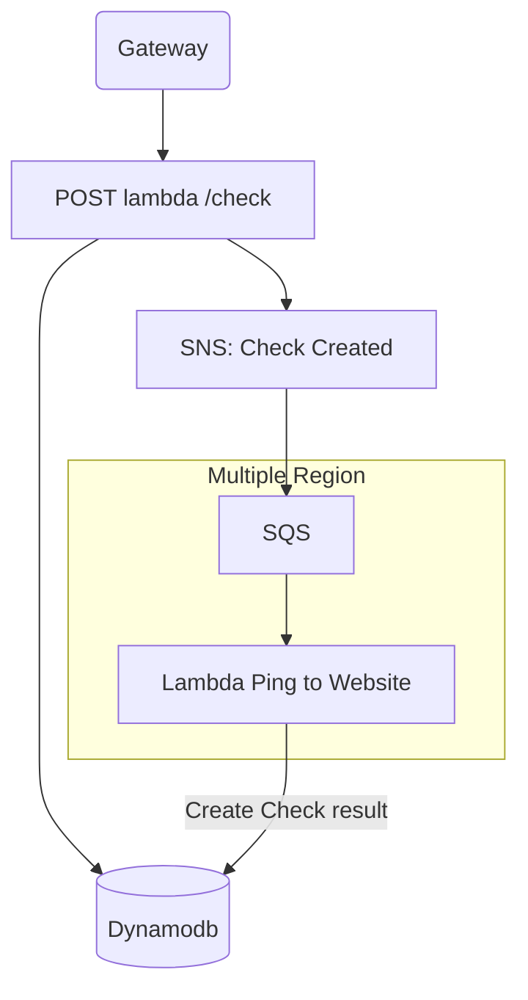
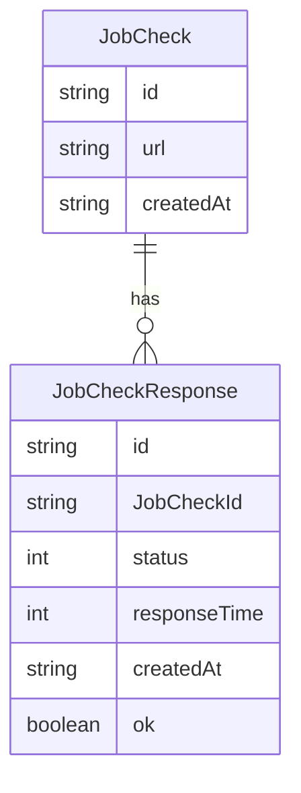

## Invoke function with SAM

```shell
# Remember to build the function
pnpm build

# Invoke single function
sam local invoke --hook-name terraform --event ./src/events/testEvent.json aws_lambda_function.lambda_create_check --env-vars env.jso

# Start API Gateway
sam local start-api --hook-name terraform
# Mounting lambda_create_check at http://127.0.0.1:3000/check [POST]
# Mounting lambda_get_check at http://127.0.0.1:3000/check [GET]   
# Mounting lambda_get_check_by_id at http://127.0.0.1:3000/check/{id} [GET]
```
