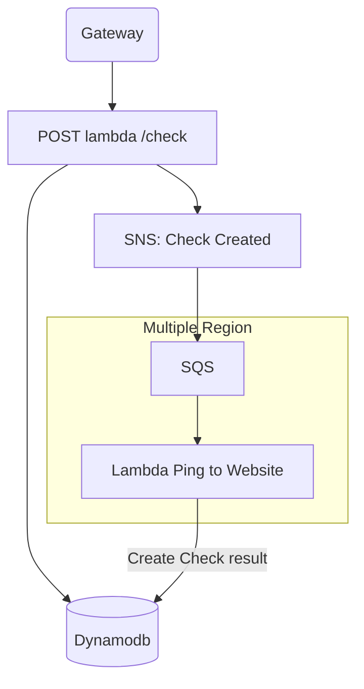

```mermaid
graph TD;
    A(Gateway) --> B[POST lambda /check];
    B --> Database[(Dynamodb)]
    B --> C[SNS: Check Created];
    C --> D[SQS];
    D --> E[Lambda Ping to Website];

    subgraph Multiple Region
      D[SQS];
      E[Lambda Ping to Website];
    end

    E -- Create Check result --> Database

```
